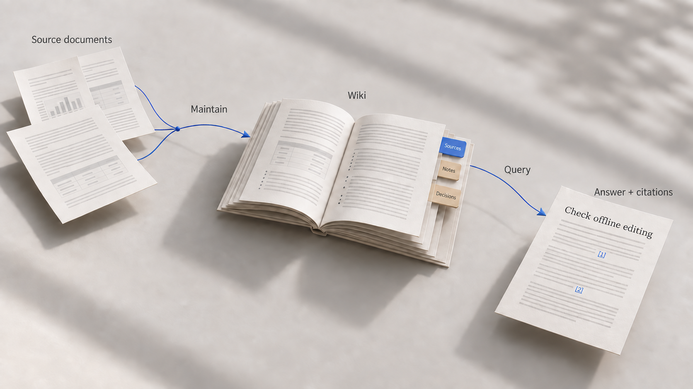

# Knowledge Studio · 0.4.24

Knowledge Studio combines an AI-maintained Markdown wiki with graph retrieval,
retained quotations and an editor for reviewing sources and shared changes.
Follow a recommendation to its requirements and evidence, save the passages it
relies on, and inspect corrections with the people working on the wiki.

If you already use an LLM-wiki, the addition is a workspace for these checks:
explained relationships participate in retrieval, selected quotations survive
source edits, and recorded file changes are available for review. The same
Markdown remains editable in Obsidian. Personal and shared wikis can stay separate
while you search and explore them together.

[Install](#install-the-skills) · [First project](#set-up-your-first-project) ·
[Editor](#work-in-the-editor) · [Obsidian](#use-an-existing-obsidian-vault) ·
[Sharing](#share-a-wiki-and-review-changes) · [Illustrated walkthrough](docs/linkedin/article.md)

## How the pieces fit



An **LLM-wiki** keeps knowledge in pages that survive between conversations.
Maintain reads sources, compares them with existing knowledge and updates the
pages. Source copies, interpretations and decisions have distinct roles. Query
reads the available wiki to answer questions with citations.

The **knowledge graph** connects wiki pages through typed, directed relationships
with written reasons. Text search finds an initial set of pages; graph traversal
reaches connected evidence. This GraphRAG approach uses BM25 keyword ranking and
does not require an embedding service. A schema checks permitted page and
relationship types. It cannot establish whether a reason is factually correct.

A **Markdown-shadow** records the structure of each page outside the Markdown
text: passages, identifiers and document revisions. Maintain can explicitly save
a selected passage as a citation before it changes. For example, a product guide
might change from "Notes can be edited offline" to "Offline access is read-only." A citation saved before the correction keeps
the earlier editing promise and its revision, so a team can revisit the app
selection against its need to write without a connection. The editor labels it
"Earlier version". Ordinary Query links do not archive quotation text. Shadow identifiers are not inserted into the text you edit.

| Task | Ask Maintain | Ask Query |
| --- | --- | --- |
| Build a wiki | "Integrate these reports into my research wiki." | |
| Work through a source | "Read this with me and help me decide what to keep." | |
| Test a conclusion | | "What supports this recommendation, and what limits it?" |
| Compare collections | | "Where does my assessment differ from the team wiki?" |
| Save evidence | "Save this selected passage as a citation." | Find the relevant passage first. |
| Update the workspace | "Integrate changed notes, review shared changes and refresh the graph." | |

Query is read-only, including its executable operations. It does not synchronize
files, update source copies or save new quotations. Run Maintain when sources or
external notes have changed and need integration.

## Install the skills

Install **both** `maintain-llm-wiki` and `query-llm-wiki` for the same platform and
version. The [package directory](dist/public/README.md) contains the downloads;
users of these packages do not need to run npm or install document converters.

| Package | Required host capabilities |
| --- | --- |
| [Claude Code](dist/public/claude-code/) | Accessible project files and Node 22.13 or later. The [package directory](dist/public/) also contains a plugin ZIP with both skills. |
| [Claude Cowork](dist/public/claude-cowork/) | Persistent project folders shared with the application, and Node 22.13 or later in its environment. |
| [Codex](dist/public/codex/) | Accessible project files, Node 22.13 or later, and complete skill folders under `.agents/skills/`. |
| [ChatGPT](dist/public/chatgpt/) | A workspace with skill support and Node file execution. Environments without persistent storage need a portable project copy. |
| [Vault Operator](dist/public/vault-operator/) | Native JavaScript skill execution and vault access. Uses Obsidian and bounded, resumable writes; does not require Node. |

Import the `.skill` packages through your application's skill management where
supported. For folder-based installation, use the complete generated folders,
including their scripts and assets. A single `SKILL.md` or a normal chat
attachment does not install the package.

The host application supplies model access and file permissions. Giving a path in
a prompt does not itself grant access to that folder. Local editing and document
preview work offline; AI operations use your host's model connection.

To update, replace both skills, ask Maintain to update the existing project's
editor and reopen it. Keep the existing project, folder connections and working
copies; an update does not require starting over or ingesting every source again.

## Set up your first project

1. Open a persistent project in your host application and connect the folders it
   needs. Give the agent read/write access to every working folder. Source folders
   are read-only by default; empty source and wiki folders are valid starting points.
2. Ask Maintain: "Set up my knowledge wiki." Specify the wiki folder, sources,
   purpose, audience, author name and editor choice: built-in editor, Obsidian or both.
3. Assign sources to wikis. One research folder can supply both your personal wiki
   and a team wiki; each wiki gets its own integration of those sources.
4. Open the project-specific editor link or `LLM-Wiki.html` returned by Maintain.
   Confirm the requested folder access. Browser permissions and the host's file
   permissions are separate.
5. Ask Maintain to integrate a small source set, then ask Query a question whose
   answer you can check against those sources.

| Folder | What it holds |
| --- | --- |
| Project | Wiki/source connections, editor settings and project state. Start both skills here. |
| Wiki | The connected knowledge collection, optionally shared with other people. |
| Working folder | Your editable, saved Markdown files. The agent, browser editor and Obsidian use this working copy. |
| Sources | Original documents used as evidence. A source folder can supply several wikis. |

The default working copies live under `.llmwiki/working/` in the project. Ask
Maintain for their actual paths before opening them in another editor. Unsaved
browser drafts are separate from saved files.

Keep the hidden `.llmwiki/` data with the project and working copies. It includes
review records, synchronization baselines and other state needed to resume work.
The local SQLite shadow cache lives outside the project and can be rebuilt;
portable identity records and saved citations are stored separately and
synchronized with the wiki. Browser and Vault queries use a read-only fallback.

Use the plus buttons beside Wikis and Sources, or ask Maintain, to connect another
folder. Connecting it does not start ingestion or create content relationships.
Run Maintain to initialize missing structure, integrate the content and refresh
the graph. Disconnecting removes the connection and preserves the files.

## Work in the editor


*Actual editor capture with fictional English notes.*

| Tool | What it helps you do |
| --- | --- |
| Markdown source, live preview and reading mode | Revise a conclusion, inspect the stored text or read without editing controls. |
| Document properties and outline | Set type and status, inspect metadata, rename a page and navigate long notes. A detail editor handles nested YAML values. |
| Images and attachments | Paste or drop an image into a note and retain local attachments, including relative Obsidian attachment folders. |
| Search and wiki/source sidebar | Find files, open originals and switch between connected collections. |
| Multi-wiki graph | Select wikis, follow a node to its file and inspect the type and reason of a relationship. |
| Office and PDF viewer | Read supported originals without changing them. |
| Saved citations | Open retained wording and highlight a current passage; distinguish historical evidence from today's text. |
| Change review | Compare revisions, review individual changes, comment, reply and propose another version. |

The editor saves after a short typing pause and preserves local drafts. Missing
write access, a missing author or a concurrent file change pauses automatic
saving. Review competing versions before continuing.

The graph displays Maintain's saved project snapshot. Ask Maintain to refresh it
after integrating notes or changing relationships. Reloading the browser reads
that snapshot; it does not perform a new semantic analysis.

The interface supports English and German. How you open it depends on the host:

- In a suitable local Node environment, Maintain starts a local editor server and
  returns a project link. Generated start files reopen that project later.
- Without a local server, open the standalone HTML in Chrome or Edge and select
  the requested folders. This file-access workflow requires those browsers;
  Firefox is not a writable substitute.
- A remote execution environment needs a reachable preview or the standalone
  HTML/Obsidian route. A container's localhost address is not your laptop's server.
  Vault Operator uses Obsidian.

Always use the start file returned for the project. Copying it into a source or
wiki folder does not create an equivalent project entry point.

## Use an existing Obsidian vault

Connect the vault under **Wikis**, then ask Maintain:

> Integrate the connected vault into this project. Preserve my notes, IDs,
> properties and attachments. Add missing wiki structure, update navigation and
> maintain the knowledge graph. Use the existing connection.

Maintain checks access, brings the files into the working copy, initializes
missing structure and reads new or changed notes. It preserves your own content
and does not duplicate every note as an external source. Embedded images are
assessed with their note. Unresolved links remain findings rather than guessed
connections.

Select **Obsidian** or **both editors** in the setup and open the actual working
folder as an Obsidian vault. When working copies are separate, open the appropriate
one for each wiki. Both editors use the same saved files, so no export/import is
needed. Keep every working folder connected with read/write access in the host.

Writing in Obsidian does not automatically run the skills. Call Maintain to
integrate edits, exchange reviewed changes and update navigation and the graph.
If the graph is empty just after connecting a vault, complete this first
maintenance pass. Reloading the editor alone will not build it.

## Read sources and keep evidence

Maintain supports common text formats, DOCX, PPTX, XLSX and PDF. Source copies
retain the full extracted content, including tables, slides, notes and relevant
image meaning. Scans, diagrams, protected documents or unusual Office content can
require visual reading or other tools available in the host. Unresolved extraction
gaps remain open; they are not reported as successful integration.

A single uploaded source normally starts a discussion about what to adopt. You
can accept, defer or reject insights. An upload alone is not an adoption decision.
To store an attachment, choose a connected source folder and explicitly allow new
files there. Existing originals are not overwritten.

To try retained citations, ask Maintain to refresh the Markdown-shadow, ask Query
for a passage, then ask Maintain to save the selected citation. Open its editor
link. Open the source copy in the editor to establish a comparison baseline.
Correct the original guide and run Maintain again: the saved quote keeps its
original wording and revision. A current successor is offered only for an
unambiguous, unchanged passage; the corrected read-only wording is not a
confirmed successor of the old offline-editing quote. The shadow's identity
history stores hashes and block references, not the full text of every old block. Saved quotations do not
replace document backups.

In the editor, use **Open retained quote** and paste the saved link or identifier.
The quote dialog preserves the earlier words. **Versions and changes** is a
separate file comparison: it needs a previously saved or accepted baseline, or a
recorded change containing the earlier text. A citation link in a decision note
records the chosen evidence; the graph does not automatically reconstruct which
version informed a past decision.

Maintain detects changed originals and updates their managed source excerpts.
It identifies dependent pages within that wiki through source citations and
typed relationships and must reassess their claims. Editing only a generated
excerpt while leaving the original unchanged creates a repair need; re-ingestion restores the original's
wording. Record your own interpretation separately from that excerpt.

For operation names such as `shadow.refresh`, `shadow.pin`, `shadow.status` and
`shadow.rebuild`, see the [operation reference](platforms/operations.md).

## Share a wiki and review changes

Share the wiki folder through your storage provider. Each person connects it in
their own project and uses an individual working copy and author identity. Share
original sources separately when others need them. Folder access comes from the
storage provider; an audience label in the wiki grants no permissions.

Run Maintain before and after work, or keep the browser editor open for its
synchronization. A saved working file that still matches the synchronization
baseline receives the changed shared file automatically. The change inbox and
document banner show differences from your personal saved or accepted baseline;
receiving a file does not acknowledge those differences. A first observation
establishes a baseline rather than presenting all earlier saves as unread changes.
You can accept individual changes or a file, reject changes, comment or send a
counterproposal. Resolving a discussion does not also accept its proposed text.

For conflicts, compare the common baseline with both edits. The current sync
protocol preserves a whole-file conflict when both sides changed differently,
including edits to separate paragraphs. Choose one version or explicitly combine
them. The latest timestamp does not automatically win. External edits can have an
unknown author; explicit authorship confirmation records your claim, not an
authenticated identity.

Collaboration is asynchronous. There are no shared live cursors or permanent
background sync service. The browser syncs while open; Maintain syncs during its
work. Obsidian alone does not run this exchange. Disconnecting and synchronization
do not propagate deletions. Unsaved browser drafts remain local.

Keep backups or use your storage provider's version history for long-term
recovery. The application history covers recorded revisions, not every external
save. To move a working copy, stop editing and ask Maintain to move it to an
accessible empty folder; the managed move preserves state and keeps the old copy.

## Limits to consider

Search can miss a passage when wording differs or a useful relationship is absent.
There is no vector search in the current implementation, and this project makes
no measured accuracy claim against vector RAG. Review the evidence behind an
answer, especially when source extraction is incomplete or access is restricted.

The graph checks structural rules, not truth. A preserved quotation proves what
was cited, not whether the quotation is correct or still relevant. Maintaining
source copies and revisiting conclusions after corrections remain part of the work.

## Build from source

Use the [ready-made packages](dist/public/README.md) unless you want to build them.
Building requires Node 22.13 or later:

```sh
npm ci
npm run build
```

The build creates both skills for five platforms, the Claude Code plugin and
[release checksums](dist/public/release-0.4.24.json). Generated downloads are available in this repository and on its release page; a source checkout can rebuild them from the pinned lockfile.

The public repository contains product sources and build tooling. Automated runtime,
browser and acceptance fixtures live in the private development repository and are
not included in a public checkout; there is no public `npm test` command. Public
contributions should include a minimal reproducible case, expected behavior and
an explanation of how the change was checked. Maintainers run the private regression
and package checks before integrating a contribution. Do not include personal wiki
content, credentials or private host configuration in an issue or pull request.

The editor includes offline formula rendering and guided relationship/footnote
insertion under **More formatting**. Search reports any wiki omitted by a small
seed limit and describes conservative German word-form expansions. It does not
claim dictionary-level understanding of every language.

Knowledge Studio builds on Mark Zimmermann's
[SkillSafeWerkstatt](https://github.com/GodModeAI2025/SkillSafeWerkstatt), with
file-wise adoption of parts of its integrity core. See [NOTICE.md](NOTICE.md) for
attribution and [LICENSE](LICENSE) for the Apache 2.0 license.

[Public repository](https://github.com/pssah4/knowledge-studio)
