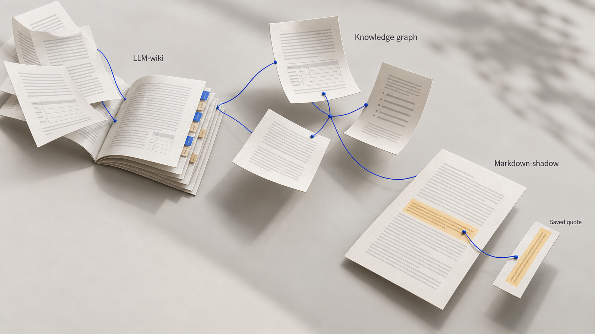
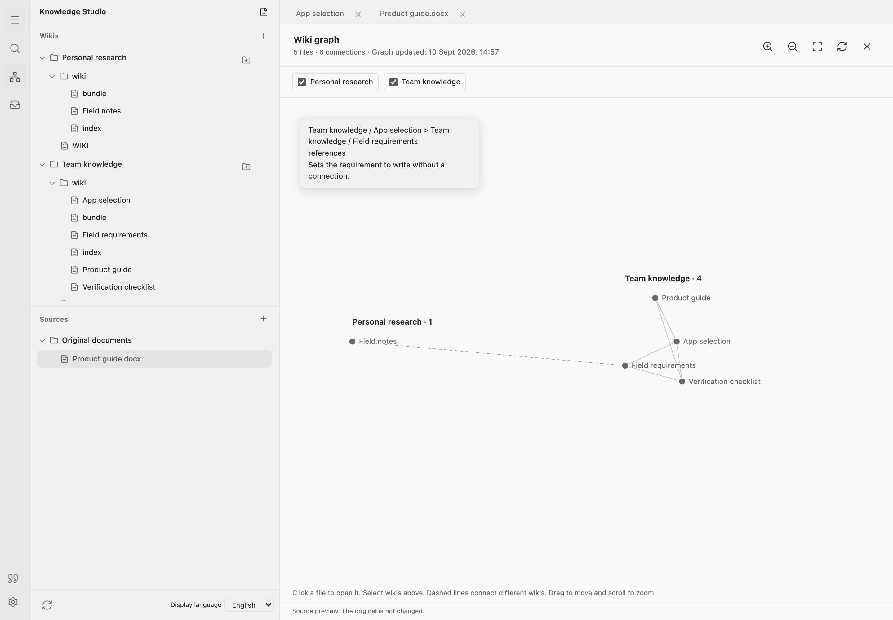
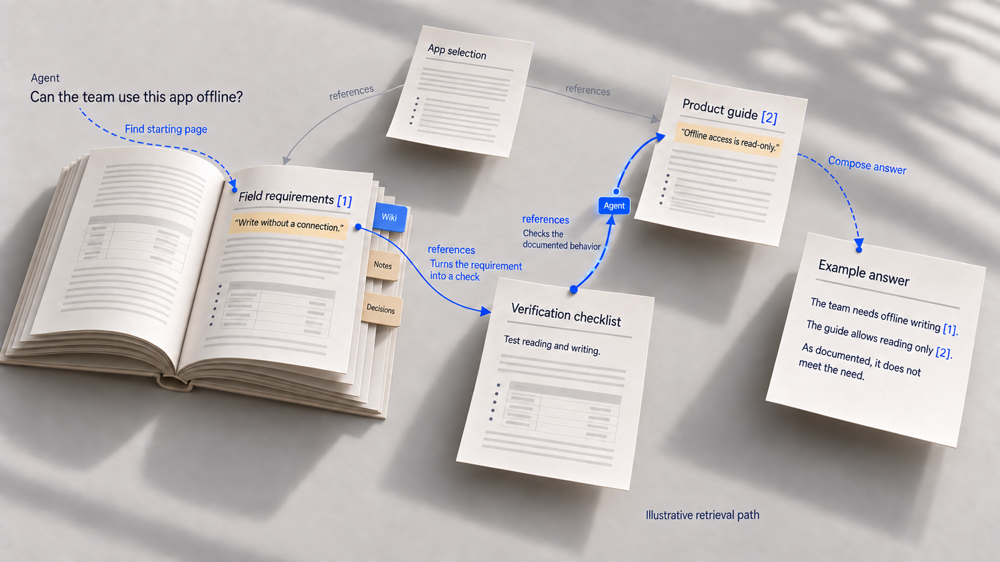
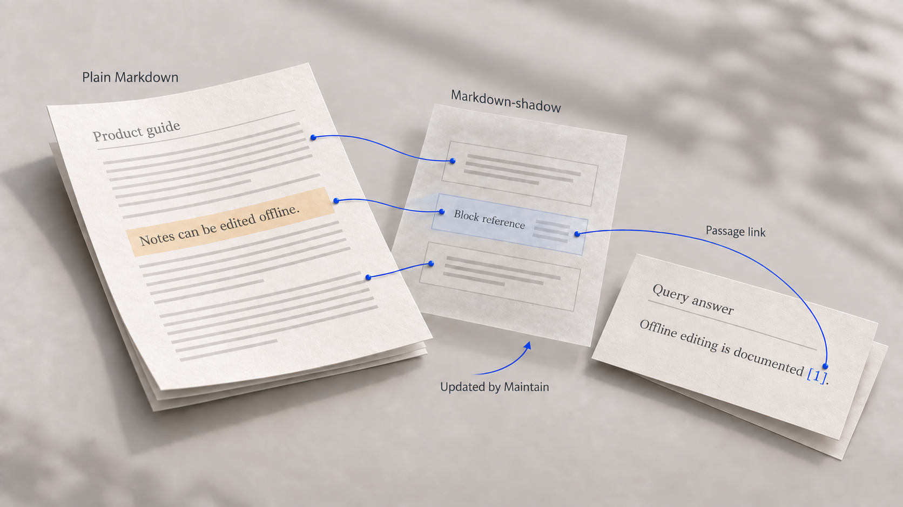
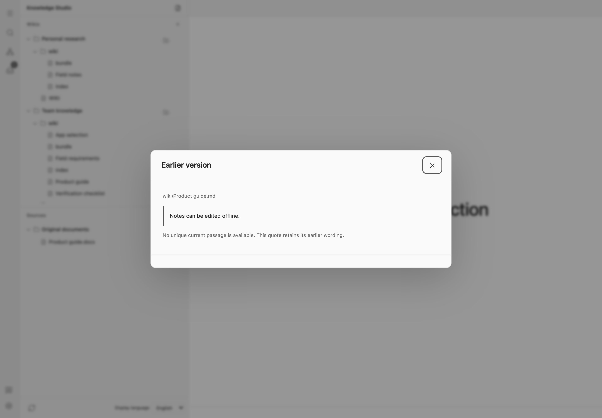
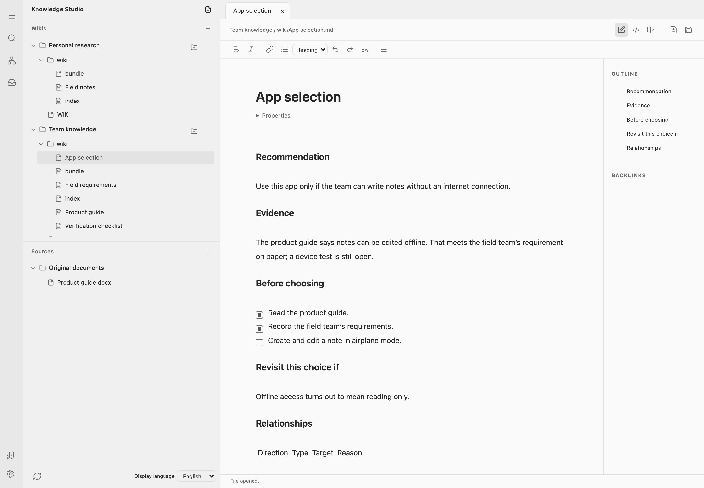

# Graph & Shadow: Wissen verbinden. Fundstellen bewahren.

Eine KI empfiehlt, ein Vorhaben freizugeben. Worauf stützt sie sich? Welche Quelle spricht dagegen? Und was stand in dem Absatz, bevor jemand ihn überarbeitet hat?

Ein LLM-Wiki bereitet Quellen zu einem dauerhaften Wissensbestand auf: thematische Seiten, Querverweise und Belege in Markdown. Neue Dokumente ergänzen diesen Bestand, spätere Fragen greifen darauf zurück. Wissen bleibt so auch außerhalb eines Chats lesbar und bearbeitbar.

Meine Erweiterung verbindet zwei Zugriffsebenen auf dieses Wissen:

- **Knowledge Graph:** Wie hängen die Wiki-Seiten fachlich zusammen, und warum?
- **Markdown Shadows:** Welche Textstelle in welcher Fassung ist gemeint?

Der Graph macht Beziehungen explizit. Der Shadow bildet die Textstruktur außerhalb der Markdown-Dateien ab und ermöglicht genaue, revisionsbezogene Fundstellen. Beide ergänzen denselben frei bearbeitbaren Bestand. Ein eingebauter Editor kommt als gemeinsame Arbeitsoberfläche dazu.

## Die Grundlage: Mark Zimmermanns SkillSafeWerkstatt

Mark Zimmermann hat dieses Prinzip mit [SkillSafeWerkstatt](https://github.com/GodModeAI2025/SkillSafeWerkstatt) in zwei zusammengehörige Skills umgesetzt. `maintain-llm-wiki` baut das Wiki auf und pflegt es. `query-llm-wiki` liest einen geprüften Stand und beantwortet Fragen mit Belegen, ohne dabei Inhalte zu verändern.

Die Werkstatt trennt Originaldokumente, quellengetreue Markdown-Abbilder und aufbereitete Wissensseiten. Graphansichten, strukturierte Aussagebeziehungen, Belegketten und nachvollziehbare Freigaben gehören bereits zu dieser Grundlage.

Mein Repository baut darauf auf und übernimmt Teile des technischen Kerns. Mein Schwerpunkt ist die Integration von schema-geprüften, begründeten Seitenbeziehungen und einer externen Block- und Belegverwaltung für frei geschriebene Markdown-Texte.

## Der Graph bekommt fachliche Bedeutung

Ein Beispiel: Die Seite „Freigabe“ verweist auf die Quellenseite „Testbericht“. Die Kante trägt den Typ `references` und die Begründung: „Der Bericht dokumentiert die erfüllten Freigabekriterien.“ Eine weitere Beziehung kann ein Konzept präzisieren oder einen Widerspruch festhalten. Unterschiedliche Ergebnisse unter unterschiedlichen Bedingungen allein belegen noch keinen Widerspruch.

Die Knoten sind **Wiki-Seiten**. Jede semantische Kante hat einen Typ, eine Richtung, ein Ziel und eine lesbare Begründung im Markdown. Ein gemeinsames Schema prüft zulässige Seitentypen und Beziehungen. Fachlich bewerten müssen wir die Begründungen weiterhin selbst.

Die Suche kombiniert Volltexttreffer mit der Navigation im Graph. So kann sie von einer Empfehlung zu verknüpften Quellen und Gegenbelegen gelangen. Das ist ein GraphRAG-Ansatz ohne erforderlichen Embedding-Dienst. Sein Nutzen hängt davon ab, wie sorgfältig die Beziehungen gepflegt sind.

*Der Graph zeigt Verbindungen zwischen Recherche und Teamwissen. Die ausgewählte Beziehung enthält eine fachliche Begründung.*

## Frei schreiben und trotzdem genau belegen

Die Werkstatt strukturiert Aussagen in eigenen Belegblöcken. In meinem Ansatz bleiben neue Wissensseiten zusammenhängende Markdown-Texte, die ich auch in Obsidian oder einem anderen Editor bearbeiten kann. Für genaue Textbezüge braucht es deshalb eine separate Struktur.

Das übernehmen seit Version 0.4.17 die **Markdown Shadows**: eine externe Abbildung von Absätzen, Überschriften, Listen und Codeblöcken samt Kennungen, Textbereichen und Dokumentfassung. Die Adressierung fügt keine Blockmarkierungen in die Markdown-Dateien ein.

Der Seitengraph führt zum Testbericht. Der Shadow adressiert darin etwa den Absatz „Die Anlage liefert 12 MW.“ Ein Textblock wird dadurch weder automatisch zur geprüften Aussage noch zum semantischen Graphknoten. Beide Ebenen erfüllen unterschiedliche Aufgaben im selben Arbeitsablauf.

*Links der Text, rechts sein externes Textstellen-Verzeichnis. Hervorhebung und Nummern veranschaulichen die Zuordnung; der Shadow schreibt sie nicht in die Markdown-Datei. Fiktives Beispiel.*

Die Node-Laufzeit pflegt dafür je Projekt einen lokalen SQLite-Spiegel außerhalb des Projektordners. Dieser Cache lässt sich neu aufbauen. Dauerhafte Identitätshistorie und ausdrücklich gespeicherte Zitierbelege liegen getrennt davon und werden mit dem Wiki abgeglichen. Die laufende Datenbank wird nicht synchronisiert.

Der Ablauf bleibt bewusst aufgeteilt: **Maintain aktualisiert, Query findet, Maintain speichert ausgewählte Belege.** Query erzeugt keine Zitierdatensätze. Ein gespeicherter Beleg lässt sich im Editor öffnen.

Steht später „14 MW“ in der Datei, behält der alte Beleg „12 MW“ und seine ursprüngliche Fassung. Eine eindeutige, unveränderte Nachfolgerstelle kann separat angeboten werden. Bei Bearbeitungen oder Mehrdeutigkeit darf das System keine Fortführung behaupten.

Query prüft die aktuellen Dateien. Fehlt der Spiegel oder ist er veraltet, werden die Textstellen vorübergehend lesend ermittelt. Browser und Vault nutzen ebenfalls diesen Weg; dauerhafte SQLite-Pflege benötigt Node. Vektorsuche könnte die Suche künftig ergänzen.

Die gezeigte lokale Demo prüft gespeicherte und historische Zitate im echten Editor. Sie ersetzt keine fachliche und native Abnahme aller Zielumgebungen.

*Schematisches Beispiel: Die Datei ändert sich von 12 auf 14 MW. Der ausdrücklich gespeicherte Beleg behält 12 MW und die zitierte Fassung.*

*Echte Editoraufnahme mit synthetischen Notizen: Ein gespeicherter Wortlaut bleibt nach der Überarbeitung als „Frühere Fassung“ erhalten.*

## Wissen selbst einordnen

Zur Pflege gehört für mich auch die Aneignung im Dialog. Die KI vergleicht eine Quelle mit vorhandenem Wissen, arbeitet Widersprüche heraus und bespricht mit mir, was ich übernehmen möchte. Ich kann Erkenntnisse annehmen, zurückstellen oder ablehnen. Die Entscheidung bleibt mit ihren Belegen nachvollziehbar.

Damit ist erkennbar, welche Einschätzung ich tatsächlich übernommen habe. Ändert sich eine Grundlage, kann ich sie erneut bewerten. Eigene Notizen und eingebettete Bilder gehören ebenfalls zu diesem Bestand.

## Persönliches Wissen und Teamwissen zusammen nutzen

Mehrere Wikis lassen sich verbinden und gemeinsam befragen: Wo weicht meine Bewertung vom Teamstand ab, und welche Quellen erklären den Unterschied? Die Suche berücksichtigt die ausgewählten, zugänglichen Wikis und erhält deren Zuordnung.

Für die Zusammenarbeit gibt es getrennte Arbeitskopien und einen Abgleich mit Änderungsprüfung. Jede Person kann Änderungen vor der Übernahme ansehen. Bei Konflikten bleiben Ausgangsfassung und beide Bearbeitungen verfügbar.

## Dazu kommt ein eingebauter Editor

Der mitgelieferte Browsereditor verbindet Markdown-Bearbeitung, Quellenansichten, Graph und Änderungsprüfung. So kann die KI Inhalte vorbereiten, während ich Quellen daneben lese und Formulierungen ändere. Obsidian und andere Editoren arbeiten mit denselben gespeicherten Dateien; Export und erneuter Import entfallen.

*Der Editor mit deutschen Beispielnotizen. Dieselben gespeicherten Markdown-Dateien lassen sich auch in Obsidian nutzen.*

## Für welche Agenten die Skills verfügbar sind

Die öffentlichen Pakete gibt es für **Claude Code, Claude Cowork, Codex, ChatGPT und Vault Operator**. Beide Skills werden für dieselbe Plattform und Version installiert. Node-basierte Pakete benötigen Node ab 22.13 und Zugriff auf die Projektdateien. ChatGPT setzt eine Arbeitsumgebung mit Skill-Unterstützung und Node-Dateiausführung voraus; ein normaler Chat erhält dadurch keinen lokalen Ordnerzugriff. Vault Operator nutzt seine native JavaScript-Umgebung und Obsidian, für Shadow-Abfragen mit dem beschriebenen lesenden Rückfall.

## Was daran neu ist, und was schon bekannt war

Eine aus Markdown abgeleitete Blockdatenbank ist als Grundidee bekannt. [Logseqs dateibasierte Architektur](https://github.com/logseq/og/blob/HEAD/src/main/frontend/handler/common/file.cljs) liest Dateien strukturiert ein und gleicht Blockidentitäten bei externen Änderungen ab. Für dauerhaft referenzierte Blöcke schreibt Logseq auch Kennungen in Dateien. Markdown Shadows verfolgen hier eine andere Vorgabe: Ihre Identitäten und gespeicherten Zitate bleiben außerhalb des Markdown-Textes.

[Basic Memory](https://docs.basicmemory.com/concepts/knowledge-format/) verbindet Markdown, KI-Zugriff und typisierte Beziehungen. [Microsoft GraphRAG](https://microsoft.github.io/graphrag/index/default_dataflow/#phase-3-graph-extraction) beschreibt Beziehungen in natürlicher Sprache. Externe Textanker sind unter anderem bei [Hypothesis](https://web.hypothes.is/blog/fuzzy-anchoring/) und im [W3C Web Annotation Data Model](https://www.w3.org/TR/2017/REC-annotation-model-20170223/) dokumentiert.

**Mein Beitrag ist die konkrete Zusammenführung:** begründete, schema-geprüfte Seitenbeziehungen plus externe Blockadressierung und revisionsgebundene Zitierbelege über frei bearbeitbarem Markdown. Dazu kommen die getrennten Rollen für Pflege und Abfrage sowie der Editor. Für diese Kombination habe ich in den geprüften Quellen keine deckungsgleiche Beschreibung gefunden. Eine weltweite Neuheit ist damit nicht belegt.

Die [Recherche mit Quellen und Abgrenzungen](research-notes.md) hält fest, was bereits bekannt ist und welche Fragen offenbleiben.

Für mich zählt der praktische Gewinn: Von einer Empfehlung zu ihren Gründen gelangen, die gemeinte Textstelle prüfen und auch später noch wissen, was damals tatsächlich dort stand.

[Mein Repository und Installation](https://github.com/pssah4/graphhrag-llm-wiki) · [Herkunft und Lizenzen](../../NOTICE.md)
