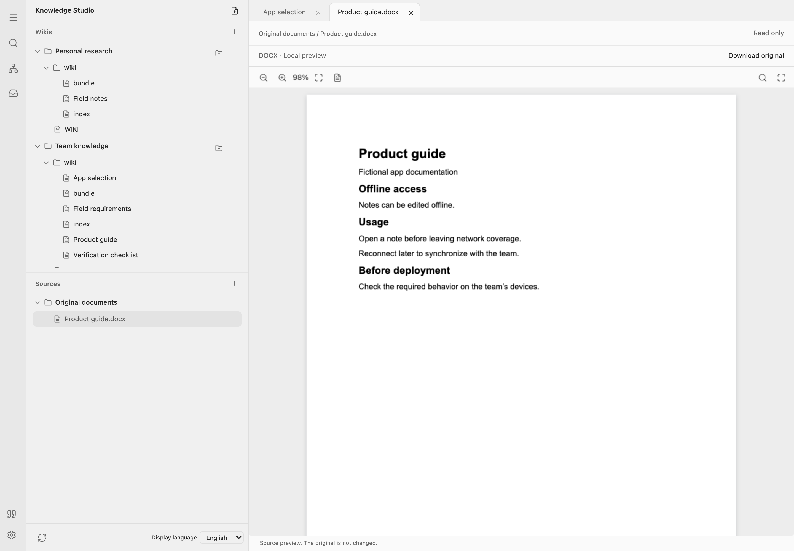
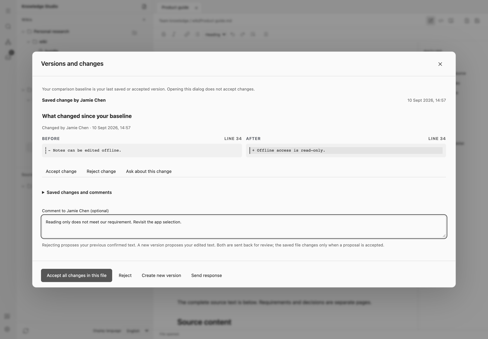

# What Knowledge Studio adds to an LLM-wiki

If you already use an LLM-wiki, you have a place where an AI assistant can turn documents into lasting knowledge. The next question is how you check that knowledge: which requirement shaped a recommendation, which source supports it, and what your colleagues changed since you last read it.

I built [Knowledge Studio](https://github.com/pssah4/knowledge-studio) around that work. It combines an LLM-wiki with graph-based retrieval, block-level passage links and an editor for inspecting sources and reviewing changes. You can examine the reasoning recorded in your notes, open cited passages and discuss a correction in the same workspace.

Consider a field team choosing a notes app. Team members visit locations without mobile coverage, so they must be able to **write without a connection**. The product guide says, "Notes can be edited offline." Later, the guide is corrected to "Offline access is read-only." The app no longer meets the requirement as documented. The team needs to revisit its choice and understand why the earlier choice seemed reasonable. This is a fictional example used throughout the article.

### The LLM-wiki keeps the knowledge between conversations

An LLM-wiki is a collection of linked pages that an AI assistant helps build and maintain. Sources, notes and decisions remain available after a conversation ends, so the next question can build on earlier work.

When you run **Maintain**, it checks connected folders for new or changed material and guides the assistant through reading it and updating the wiki. **Query** retrieves passages from the available wiki for the assistant to answer with citations. Query's retrieval tools are read-only; asking a question does not rewrite the knowledge base or ingest changed originals.

The skills provide instructions and executable tools. The assistant interprets the sources and writes the explanations connecting them. Those judgments can be wrong even when the software verifies a quote's wording and location. The cited passages let you check whether an answer follows from its sources.

*Maintain updates the collection when invoked. Query gives the assistant passages to use in its answer.*

The pages are ordinary Markdown files. You can edit them in the built-in editor or Obsidian. A source copy preserves the product guide; a requirements page explains why offline writing matters; a decision page records the proposed app choice. These separate roles let you examine a conclusion without confusing it with the source's words.

### The graph makes relationships useful during retrieval

Text search supplies starting pages. A knowledge graph adds routes between them: each node is a wiki page. A typed semantic connection has a direction and a written reason explaining the relationship. Ordinary navigation links can also appear in the graph; the search expands through the valid typed connections.

The illustration shows one possible retrieval path. Text search finds "Field requirements", shown as an open page in the wiki book. Retrieval follows a stored "references" connection to "Verification checklist": the checklist turns the requirement into a check. A second connection leads to "Product guide", whose documented behavior is what the checklist tests. With these relationships in place, this two-step route can bring the guide into context even if it was not an initial text match.

*A schematic example, not a recorded agent run. Blue connections show a possible retrieval path; gray connections show other relationships. The example answer cites the requirement [1] and guide [2].*

Here, GraphRAG means retrieval that combines text matches with connected pages. The retrieved context includes the relationship type, its reason and the page through which each additional page was reached. The assistant must assess whether those pages support the answer. In this example, the requirement and guide provide the basis for explaining why documented offline reading does not meet a need for offline writing.

For the reader, this provides two ways to check an answer: open its cited pages and inspect why those pages are connected. The graph helps navigate beyond matching words; the sources let you assess whether the conclusion follows.

The current retrieval path uses keyword ranking and graph traversal, without an embedding service. Missing relationships, vocabulary gaps and incomplete source extraction can limit what it finds. A schema checks permitted page and relationship types; it cannot decide whether a relationship is factually justified or a source is right.

### The Markdown-shadow makes passages addressable without marking up the text

A graph connects pages. I also wanted to cite individual passages in ordinary Markdown files without adding an identifier to every paragraph or maintaining those identifiers by hand. [Notion represents page content as blocks](https://developers.notion.com/guides/data-apis/working-with-page-content). [Obsidian supports block links](https://obsidian.md/help/links), but its block identifiers extend the Markdown text and are specific to Obsidian. My aim with the Markdown-shadow is to keep the block references outside the file, leaving the Markdown unchanged for reading and editing.

The implementation identifies paragraphs, headings, lists, tables and code blocks in the connected wikis and records their identities and positions separately. On a supported Node installation, each completed Maintain run refreshes this shadow against the current files. It detects changes made in Knowledge Studio, Obsidian or another editor once they are available in the accessible working copy. You do not need to insert or repair block markers yourself.

Query can use these passages immediately to produce citations; saving a quotation first is unnecessary. A citation opened from an exported Query answer takes you to the exact passage in Knowledge Studio. Query also checks the current file contents: if the persistent shadow is stale or absent, it reads the current block structure without writing a replacement cache. Persistent identities are available again after successful maintenance.

*Maintain updates the external block references. Query uses them to cite a passage without inserting identifiers into the source Markdown. This is a conceptual illustration.*

The current links depend on Knowledge Studio and the originating project and working copy; this is not yet a format that arbitrary Markdown applications resolve. Even the built-in editor does not yet open these links correctly when they are embedded in another wiki note. An unchanged, uniquely identifiable block can keep its identity after moving. Editing its wording creates a new reference: an old citation does not silently switch to the changed text. Maintenance removes the manual work of updating the block records; it cannot guarantee that every existing citation survives an edit.

Retaining earlier wording is a separate, optional feature. Ask Maintain to **save a passage as a citation** before changing it, using a supported Node installation. In the example, this keeps "Notes can be edited offline" available after the correction. Ordinary passage links do not archive old text. Browser-only and Vault Operator runtimes can read current passages and resolve already saved quotations, but cannot maintain the persistent shadow or create new retained quotes on their own.

### The editor puts the checks beside the writing

The screenshots below show the actual application with fictional English content. The demo ingests and corrects a Word document through the software; its decision notes and relationships were written in advance. It demonstrates the editor and evidence-handling workflow, not how reliably an AI assistant would produce the same analysis unaided. The book-and-paper images are AI-generated illustrations.

*Write the decision, record the remaining device test and navigate its sections in live preview.*

Markdown source, live preview and reading mode work on the same file. Properties expose the page's type and status. The outline helps with longer notes; checklists keep unresolved checks beside the recommendation. Saves happen after a short typing pause, and concurrent file changes pause saving for review.

*Read the original product guide separately from the interpretation in the decision note.*

The built-in viewer opens supported Word, spreadsheet, presentation and PDF originals without editing them. The graph view can span several connected wikis, so personal research and shared knowledge remain separate collections you can explore together. It shows the graph saved by Maintain; after editing notes externally, run Maintain to update their relationships and the graph view.

*Select a connection to inspect its type and explanation; select a page to open it.*

For the optional saved-quotation workflow, **Open retained quote** accepts a saved citation link or identifier and displays the retained words. **Highlight passage** appears when a verified current match exists. After the offline claim changes, the dialog keeps the earlier words but offers no highlight for an assumed replacement.

*The saved quote answers “What wording did we retain?” Change review answers “What changed in the file?”*

### A correction becomes shared work

On a subsequent run, Maintain detects the changed original guide and replaces the managed source excerpt with the corrected text. It preserves the source's identity and notes outside that excerpt. Recorded source citations and typed relationships identify candidate pages within that wiki for reassessment, including "App selection" in this example. Finding a dependency does not revise the conclusion; the assistant must read and assess it. Missing references can leave affected pages undiscovered.

Editing only the generated excerpt is different: if the original still promises offline editing, re-ingestion restores that wording. A correction proposal belongs in a note until the original is corrected.

*The comparison uses an earlier personal baseline or recorded revision. The saved quote is a separate record. The comment shown is an unsent example.*

Shared wikis use separate working copies. During synchronization, a clean working copy receives an incoming correction automatically. Both participants need to synchronize, through an active browser editor or a Maintain run. A closed editor and an idle agent do not exchange changes.

**Change inbox** and the page's **Review changes** banner expose differences from your saved or accepted baseline. Recorded changes include an author and time, with comments and proposals available in the review view. An external edit can initially have an unknown author; names are attribution, not authenticated identities. Receiving an update and acknowledging it are separate steps.

If two people change the same file differently, synchronization keeps a conflict, even if they edited different paragraphs. They choose one version or explicitly combine them. There is no automatic paragraph merge or requirement that every reader approve a correction before it becomes current.

### Who this is for

I designed Knowledge Studio for work that involves returning to a conclusion, its supporting passages and other people's edits. If your existing LLM-wiki already supports those checks comfortably, you may gain little from another interface. If you currently perform them across chat transcripts, source viewers and file comparisons, this project brings them together around the Markdown you keep. The benefit described here is easier access to the material you need to review; this example does not establish better answer accuracy or faster decisions.

The combination is the contribution; linked notes, graph retrieval and text anchoring each have precedents. The project builds on Mark Zimmermann's [SkillSafeWerkstatt](https://github.com/GodModeAI2025/SkillSafeWerkstatt), including adopted parts of its integrity core. [NOTICE.md](https://github.com/pssah4/knowledge-studio/blob/main/NOTICE.md) records the attribution.

To try it, install Maintain and Query for a supported Node host and connect folders containing a test decision and its sources. Run Maintain to integrate them, then ask Query which passages support the decision and which call it into question. Open a citation from the exported answer and check the highlighted source passage. To also try the historical-evidence example, open the source copy in the editor to establish a comparison baseline and ask Maintain to save a relevant citation. Then change the test source and run Maintain again to compare the retained quote with the file's change review. Packages and setup instructions are in the [public repository](https://github.com/pssah4/knowledge-studio).
